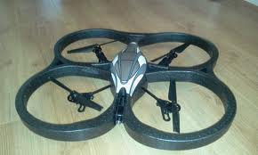
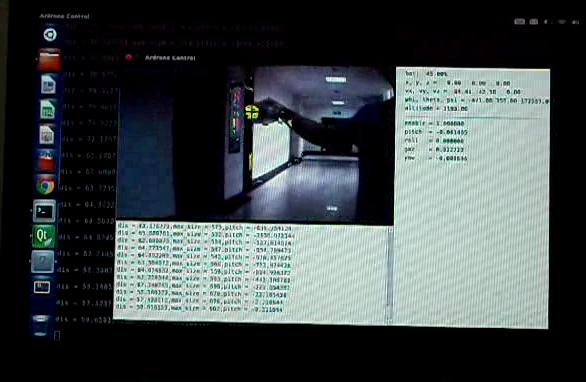

ArdroneToolkit
==============

A toolkit for one helicopter named ardrone.This project is my college graduation project. 

In this project, I try to implement the flight control system for a quadrotor named Ardrone with compute vision methods. Five fight tasks are implemented. They are color block tracking, Aruco marker detection and navigation, fight along corridor, fight video recording and auto landing.

I build this system based on some exsiting projects for example, Arcuo, heli.

> - Aruco : http://www.uco.es/investiga/grupos/ava/node/26
> - Heli : I am sorry to not find the link

I employ the UI with Qt library and CV algorithms with Opencv.There is a tiny flight video example in our code package with AVI format.

Requirements
================
> - Aruco(aleady included)
> - Qt4(http://qt-project.org/)
> - OpenCV(http://opencv.org/)
> - ffmpeg(http://ffmpeg.org/)

Compile
================
```
cd marker
make
cd ..
make
```

Usage
===============
key functions :
```
[Enter] take off / land
[Space]         auto-flight / manually
[a]             yaw -
[d]             yaw +
[Left]          roll -
[Right]         roll +
[Up]            pitch -
[Down]          pitch +
[s]             hight +
[w]             hight -
[z]             camera 0
[x]             camera 1
[p]             screen capture
```

Platform
===============
Only test on Ubuntu 10.04

Screenshot
===============




contact
===============
If you have any questions about this project, please contact me directly.  
Email : chengshaoguang1291@gmail.com  
From Xi'an, China.
